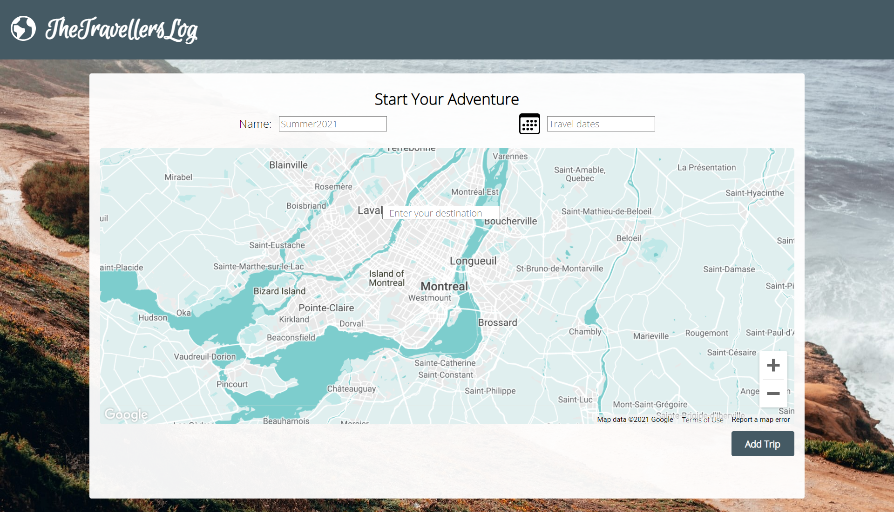
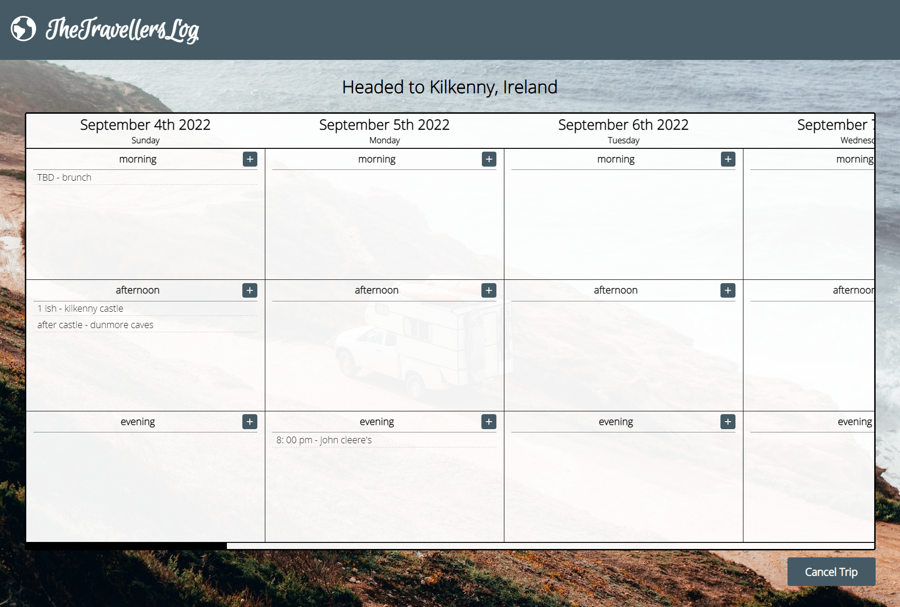
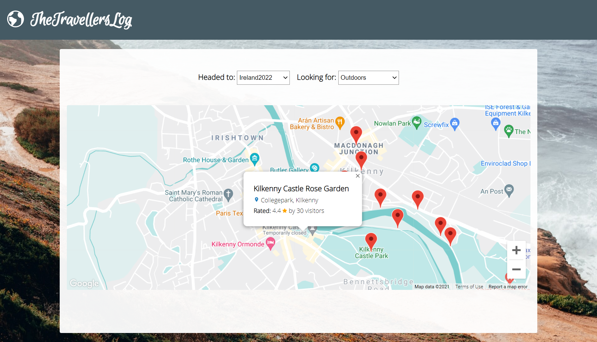
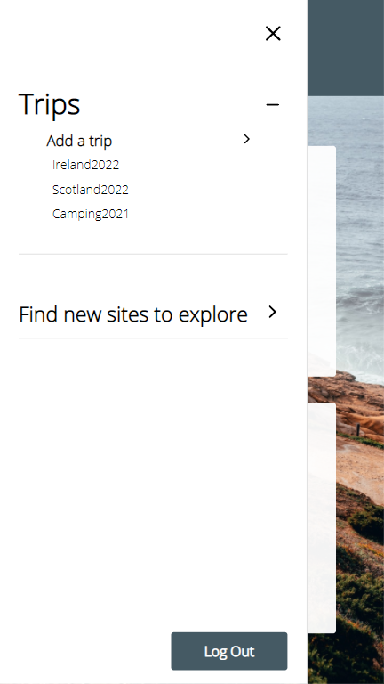
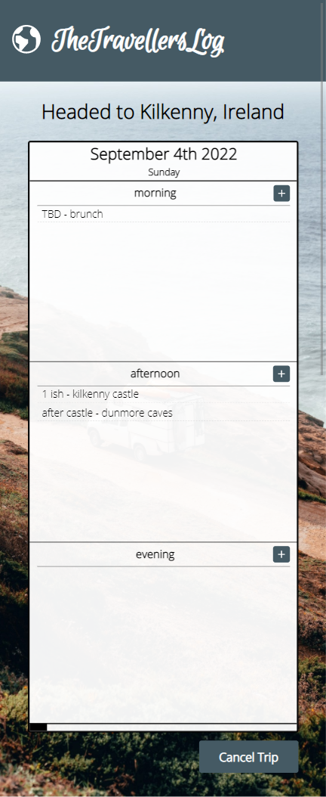

# Final Project: TheTravellersLog

# Introduction

TheTravellersLog is a travel planning website that allows users to organize their future vacation plans with ease.

# Technologies

React, Redux, styled-components, Node.js, Express, and MongoDb.
Mapping functionality is completed using Google Maps API. User authentication is completed using Auth0 API.

# Use

To start, users can name their trips and select their destination and travel dates.

Once a trip is added, users will have access to their own itinerary. Users can easily add activities to their planner using react-modal. They also have the ability to update and delete. Activities added to the same time of day can also be rearranged using a drag and drop functionality.

Another feature of this site is that users can use their trip destination to search for nearby places of interest. A user can select from a range of categories: dining, lodging, nightlife, tourist attractions, shopping, outdoors, and usefuls. The results are then mapped as markers on the map component. When a marker is selected, users are given extra information about the site (eg. price and rating).

The website is also responsive for mobile, tablet and desktop formats.

 

# Credits

Toms Rīts (@piecdesmit) for background image
